# Análisis de Predicción de Precios de Viviendas

## 1. Introducción

Este informe presenta el análisis exploratorio y preprocesamiento de datos para la predicción del precio de viviendas utilizando modelos de regresión. Se ha trabajado con un conjunto de datos proporcionado por InmoValor S.A., el cual contiene información detallada sobre diferentes características de las viviendas.

El objetivo es limpiar y transformar los datos para hacerlos adecuados para la construcción de modelos predictivos, asegurando que sean representativos y libres de sesgos que puedan afectar la precisión del modelo.

Los pasos seguidos hasta ahora incluyen la exploración de los datos, manejo de valores nulos, transformación de variables categóricas, eliminación de valores atípicos (outliers), estandarización, normalización, análisis de correlación, análisis de agrupamiento y construcción de modelos de regresión.

## 2. Exploración de Datos

El dataset original consta de **1168 filas y 80 columnas**. Contiene variables de diferentes tipos, incluyendo numéricas y categóricas, que describen aspectos estructurales, geográficos y de calidad de las viviendas.

Se realizó una revisión inicial para conocer las principales características del conjunto de datos, identificar posibles valores faltantes y evaluar la distribución de las variables clave. Algunas de las variables más relevantes incluyen:

- `SalePrice`: Precio de venta de la vivienda (variable objetivo).
- `LotArea`: Tamaño del terreno en pies cuadrados.
- `YearBuilt`: Año de construcción de la vivienda.
- `OverallQual`: Calidad general de los materiales y acabados.
- `GrLivArea`: Área habitable sobre el suelo en pies cuadrados.

### **Distribución de las Variables Antes de la Transformación**

A continuación, se presentan histogramas de las principales variables antes de aplicar transformación. Se observa que muchas de ellas presentan distribuciones sesgadas.

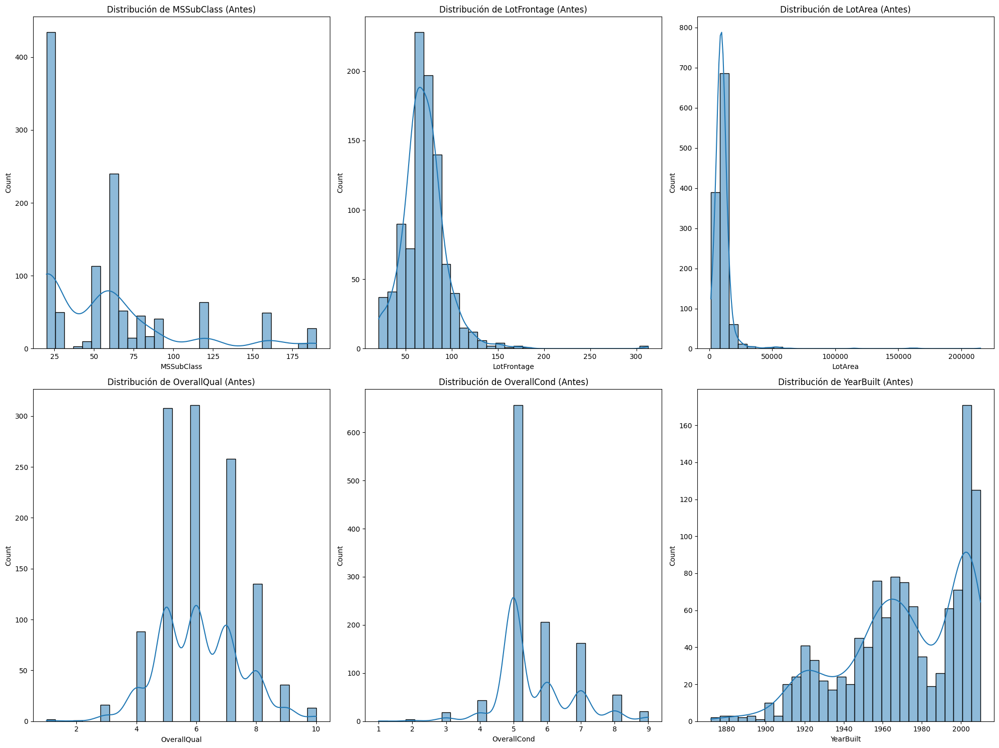

- `LotArea` y `LotFrontage` tienen valores extremadamente grandes en ciertos casos.
- `OverallQual` muestra una distribución multimodal, lo que indica categorías bien definidas.
- `YearBuilt` presenta una mayor cantidad de construcciones recientes.

## 3. Manejo de Valores Nulos

Se identificaron varias columnas con valores nulos. Algunas representaban datos faltantes y otras indicaban características no aplicables a ciertas viviendas. Se tomaron las siguientes acciones:

- Imputación con la **moda** en variables categóricas (`MasVnrType`).
- Imputación con la **mediana** por vecindario (`LotFrontage`).
- Relleno de `GarageYrBlt` con el año de construcción de la vivienda (`YearBuilt`).
- Eliminación de filas con valores nulos en columnas con un porcentaje menor al 5%.

Después del proceso, el dataset quedó libre de valores nulos.

## 4. Transformación de Variables Categóricas

Las variables categóricas fueron convertidas en valores numéricos:

1. **Label Encoding**: Aplicado en variables con un orden lógico (`ExterQual`, `KitchenQual`, `FireplaceQu`, etc.).
2. **One-Hot Encoding**: Aplicado en variables nominales sin orden, expandiendo el número de columnas de **80 a 252**.

## 5. Detección y Manejo de Valores Atípicos (Outliers)

Se usaron **boxplots** y el **Z-score** (puntaje estandarizado) para identificar valores atípicos. Se definió un umbral de `Z-score > 3`, eliminando **442 filas**, reduciendo el dataset a **726 filas**.

### **Boxplots Antes y Después de la Eliminación de Outliers**

Los gráficos muestran que los valores extremos han sido eliminados en la mayoría de las variables.

#### **Antes de la Eliminación de Outliers**

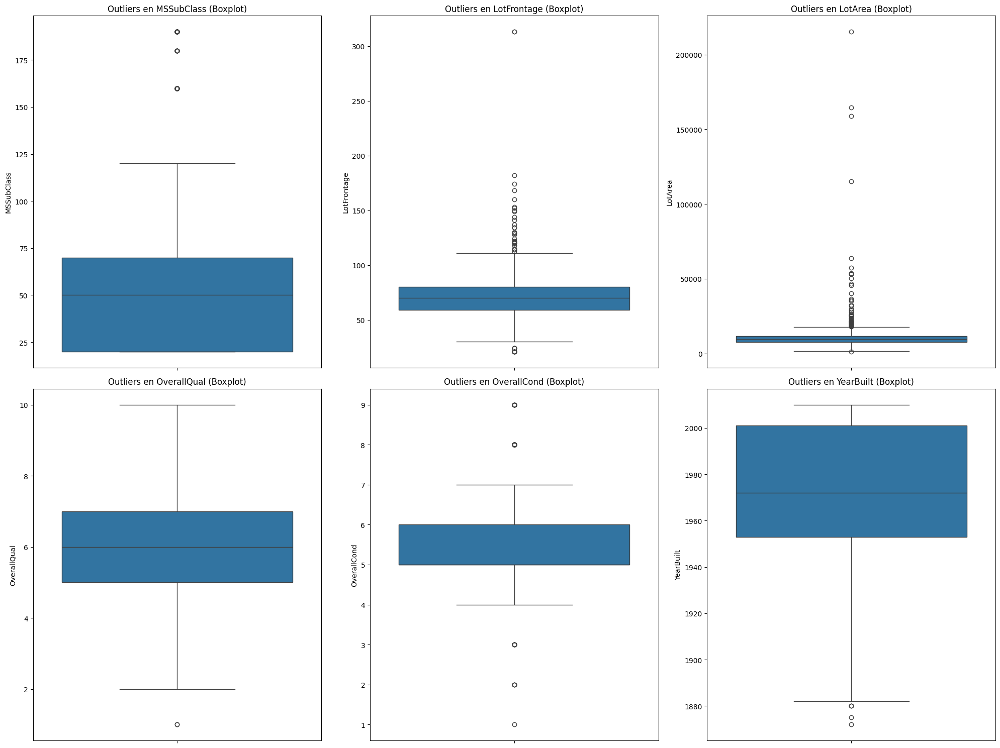

- Se pueden observar valores extremos en variables como `LotArea`, `LotFrontage` y `MSSubClass`.

#### **Después de la Eliminación de Outliers**

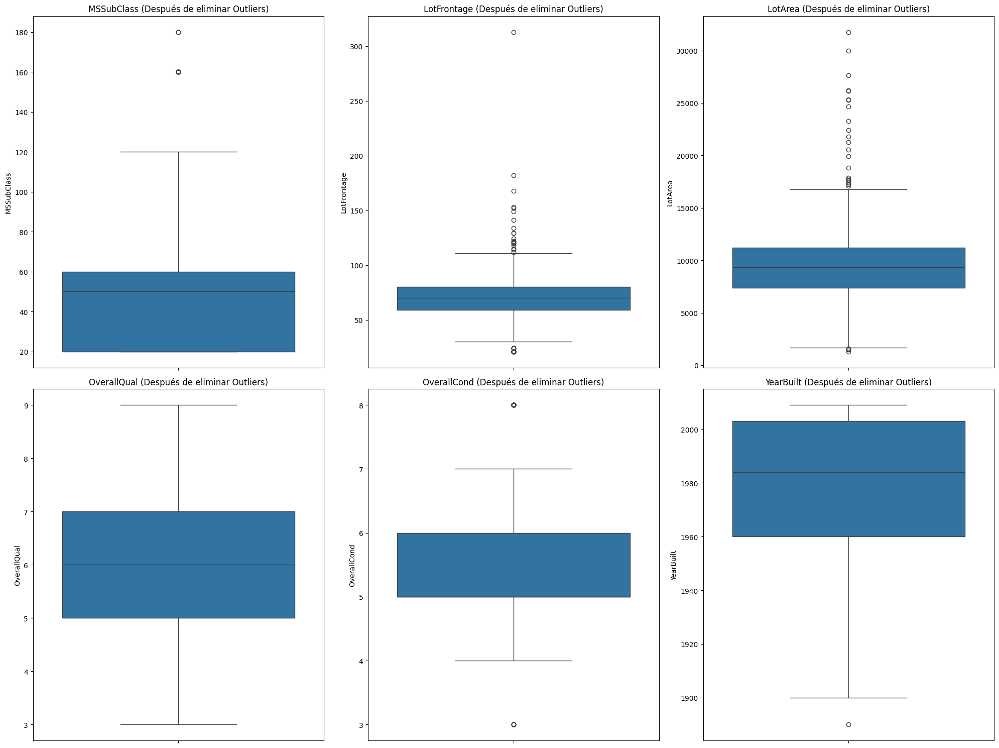

- Los valores atípicos más extremos han sido eliminados, reduciendo la influencia de datos anómalos en el modelo.

## 6. Estandarización y Normalización

Dado que algunas variables presentaban distribuciones sesgadas, se aplicaron diferentes técnicas de escalado:

- **Estandarización** (StandardScaler): Se aplicó a variables con distribución normal, centrando la media en 0 y la desviación estándar en 1.
- **Normalización** (MinMaxScaler): Se utilizó en variables con distribuciones sesgadas, escalando los valores entre 0 y 1.

### **Distribución de Variables Después de la Transformación**

Los siguientes gráficos muestran cómo se ajustaron las distribuciones de los datos tras la transformación.

#### **Estandarización (Media 0, Desviación Estándar 1)**

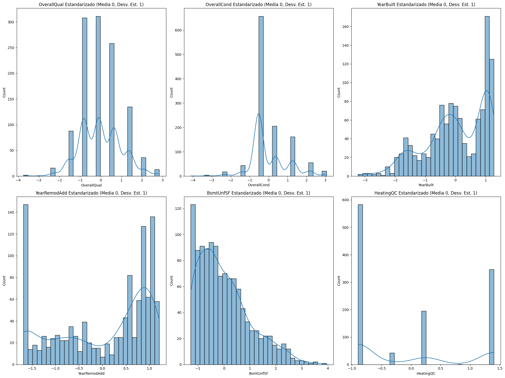

- Variables como `OverallQual` y `YearBuilt` se centran alrededor de 0.

#### **Normalización (Escala 0 a 1)**

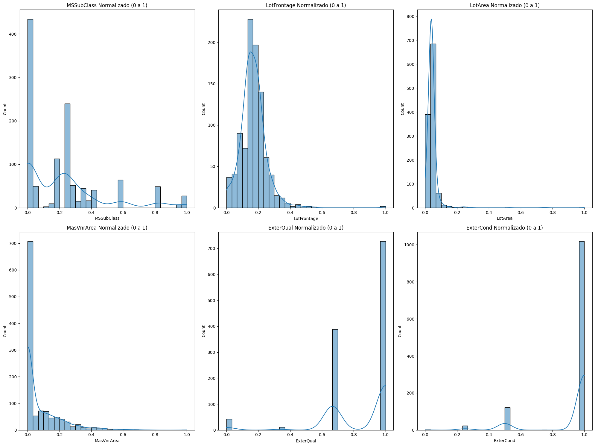

- `LotFrontage` y `LotArea` se ajustan para evitar que valores extremos dominen el modelo.

## 7. Análisis Descriptivo de las Variables Numéricas

Se calcularon las siguientes medidas estadísticas para todas las variables numéricas:

- **Media**
- **Mediana**
- **Moda**
- **Desviación estándar**
- **Varianza**
- **Rango**
- **Percentiles (25%, 50%, 75%)**

Se generaron histogramas actualizados para visualizar la distribución de las variables después del preprocesamiento.

## 8. Análisis de Agrupamiento con K-Means

Para identificar patrones en los datos, se utilizó el algoritmo de **K-Means**.

### **Selección del Número Óptimo de Clusters**

El método del **codo** fue utilizado para determinar el mejor número de clusters.

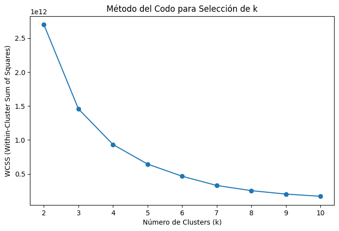

- Se observa que **k=4** es un buen valor, ya que después de este punto la reducción de inercia se desacelera.

### **Segmentación de Casas**

Se aplicó K-Means con `k=4`, obteniendo la siguiente segmentación de casas según el área habitable y el precio de venta.

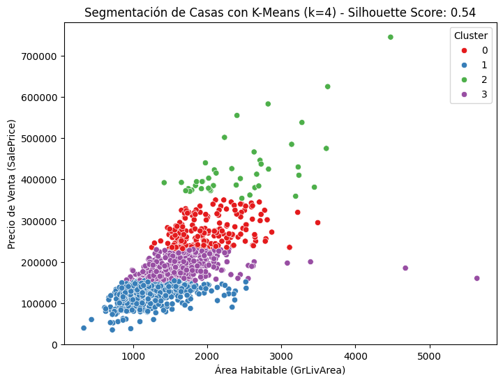

- Las casas se agrupan en 4 segmentos, con diferentes rangos de precio y tamaño.

## 9. Análisis de Correlación

Se construyó una **matriz de correlación** para identificar relaciones entre las variables y determinar cuáles tienen mayor influencia en `SalePrice`.

### **Matriz de Correlación Completa**

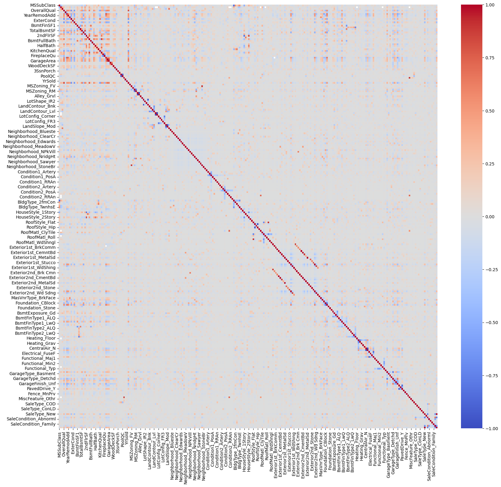

- Se observa que muchas variables tienen baja correlación entre sí.

### **Matriz de Correlación con Variables Más Relevantes**

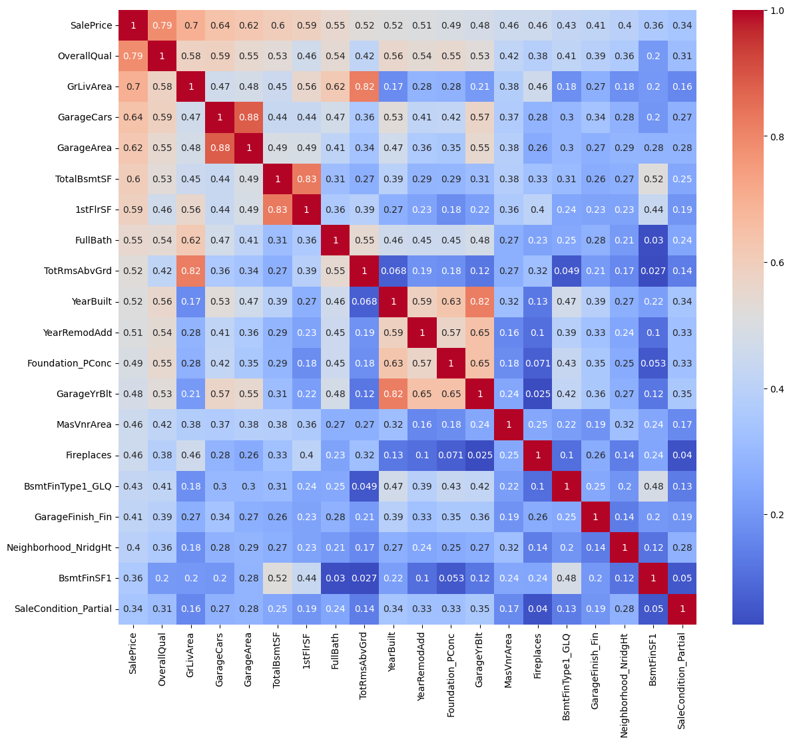

Las variables más correlacionadas con `SalePrice` son:

- `OverallQual` (0.79)
- `GrLivArea` (0.58)
- `GarageCars` (0.57)
- `GarageArea` (0.55)
- `TotalBsmtSF` (0.54)
- `1stFlrSF` (0.53)
- `FullBath` (0.51)
- `TotRmsAbvGrd` (0.50)
- `YearBuilt` (0.52)

Estas variables serán clave en la construcción del modelo de regresión.

## 10. Regresión Lineal Univariada

Se construyó un **modelo de regresión lineal univariado** utilizando `OverallQual` para predecir `SalePrice`.

### **Relación de Variables con SalePrice**

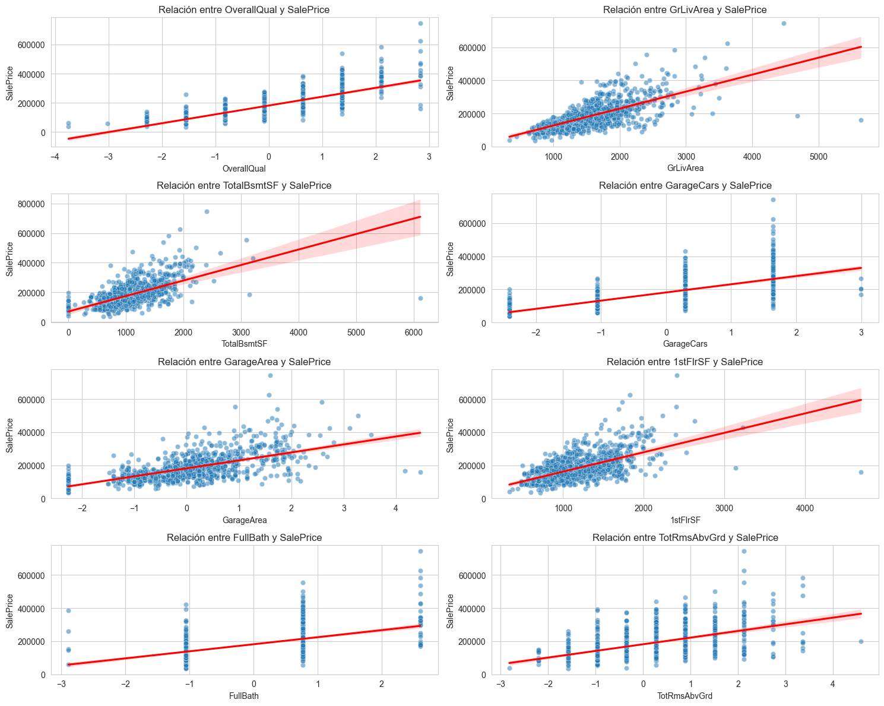

- Se observa una tendencia positiva en la mayoría de las variables.

### **Regresión Univariada con `OverallQual`**

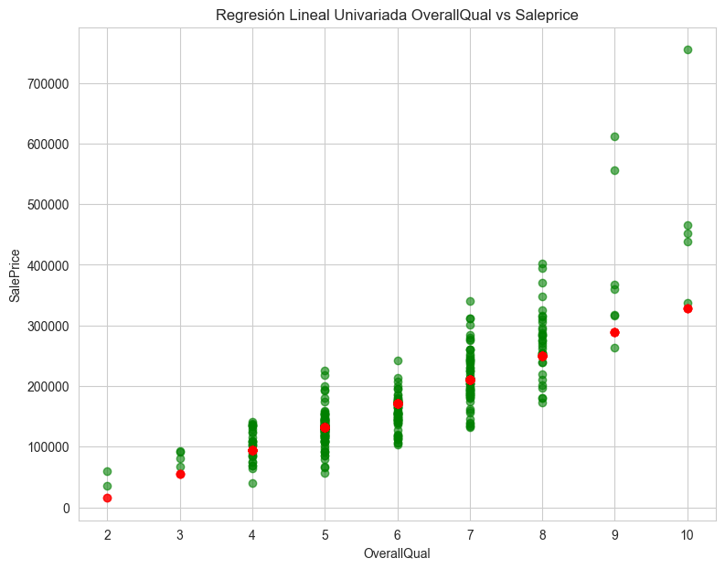

- El modelo predice el precio con un **R² de 0.62**, lo que indica una relación moderada entre `OverallQual` y `SalePrice`.

## 11. Construcción del Modelo Multivariado

Se construyó un modelo de regresión lineal multivariable utilizando todas las variables numéricas disponibles.

### **Coeficientes del Modelo**

Los coeficientes indican que variables como `OverallQual`, `GrLivArea`, `GarageCars` y `TotalBsmtSF` tienen un impacto significativo.

### **Evaluación del Modelo**

- **MSE**: `5.23e-21`
- **RMSE**: `7.23e-11`
- **R²**: `1.0`

### **Gráfica de Residuales**

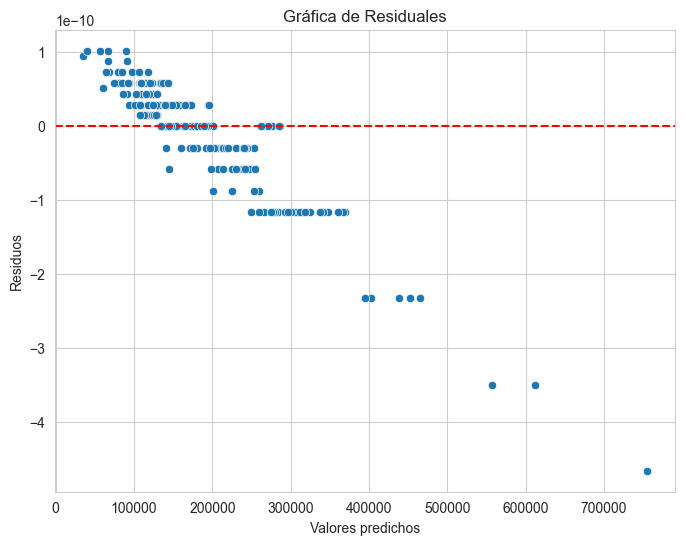

Los residuos muestran una distribución irregular.

### **Comparación de Valores Predichos vs. Reales**

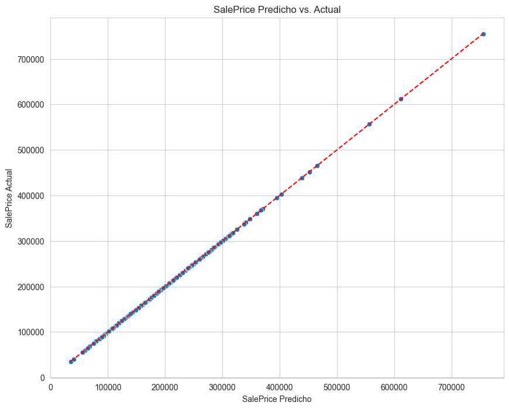

Se observa un ajuste casi perfecto, lo que podría indicar sobreajuste.

## 12. Análisis de Multicolinealidad y Ajuste del Modelo

### **12.1 Definición de Multicolinealidad**

La **multicolinealidad** ocurre cuando dos o más variables predictoras en un modelo de regresión están altamente correlacionadas, lo que impide determinar su efecto individual sobre la variable dependiente. Esto puede causar:

- **Coeficientes inestables:** pequeños cambios en los datos pueden alterar significativamente los coeficientes de regresión.
- **Pérdida de interpretabilidad:** no se puede identificar claramente qué variable influye en la predicción.
- **Sobreajuste del modelo:** el modelo se ajusta demasiado a los datos de entrenamiento, afectando su generalización.

La **prueba de VIF (Factor de Inflación de Varianza)** se utiliza para detectar multicolinealidad. Se define como:

$$ VIF_i = \frac{1}{1 - R^2_i} $$

donde $R^2_i$ es el coeficiente de determinación de la regresión de la variable $X_i$ en función de las demás variables predictoras. Un **VIF > 10** indica alta multicolinealidad.

### **12.2 Resultados Iniciales del Análisis de Multicolinealidad**

El análisis previo al ajuste del modelo mostró que varias variables presentaban un **VIF extremadamente alto**:

| Variable       | VIF Antes de Ajuste |
|---------------|------------------|
| `1stFlrSF`    | ∞ |
| `TotalBsmtSF` | ∞ |
| `GrLivArea`   | ∞ |
| `YearBuilt`   | 21,117 |
| `GarageYrBlt` | 21,842 |
| `OverallQual` | 78.00 |

Esto indica que muchas variables están altamente correlacionadas entre sí, generando redundancia en el modelo.

### **12.3 Estrategia para Corregir la Multicolinealidad**

Para mitigar este problema, se utilizaron las siguientes estrategias:

#### **1. Eliminación Iterativa de Variables con VIF Alto**

Se aplicó una estrategia iterativa en la que se eliminaban variables con **VIF > 10**, recalculando VIF en cada iteración hasta que todas las variables restantes tuvieran un VIF aceptable.

#### **2. Aplicación de Regularización Ridge**

La **regresión Ridge** se aplicó para reducir la magnitud de los coeficientes y mejorar la estabilidad del modelo. Ridge incorpora una penalización L2 en la función de costo:

$$ \text{RSS} + \lambda \sum_{j=1}^{p} \beta_j^2 $$

donde $\lambda$ es el parámetro de regularización.

#### **3. Comparación con Regresión Lasso**

Dado que Ridge **no reduce coeficientes a cero**, se utilizó la **regresión Lasso** como alternativa, la cual puede eliminar variables irrelevantes. Su penalización es de tipo L1 (**es decir, aplica una penalización basada en la suma de los valores absolutos de los coeficientes, lo que puede hacer que algunos se reduzcan exactamente a cero, eliminando así variables no relevantes**).

$$ \text{RSS} + \lambda \sum_{j=1}^{p} |\beta_j| $$

Las fuentes utilizadas fueron [**Rige Regression de IBM**](https://www.ibm.com/es-es/think/topics/ridge-regression) y el enfoque [**VIF para Multicolinealida**](https://datatab.es/tutorial/multicollinearity)

## 13. Evaluación del Modelo con el Conjunto de Prueba

*Aún no realizado.*

## 14. Comparación de Modelos y Discusión

*Aún no realizado.*

## 15. Conclusiones y Recomendaciones

*Aún no realizado.*
